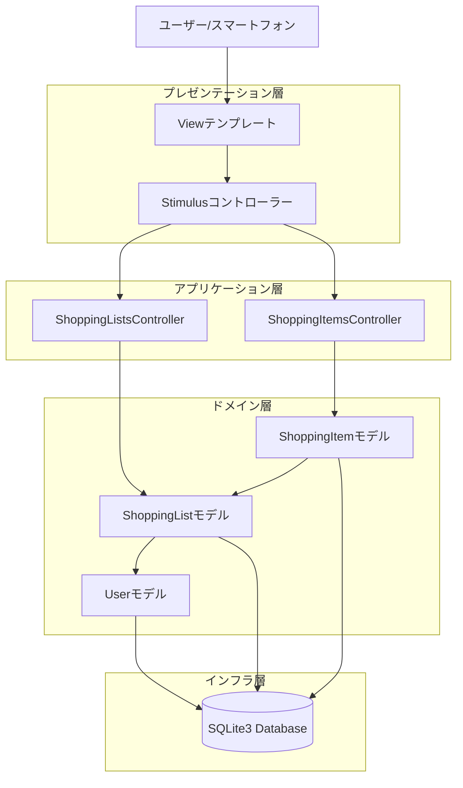
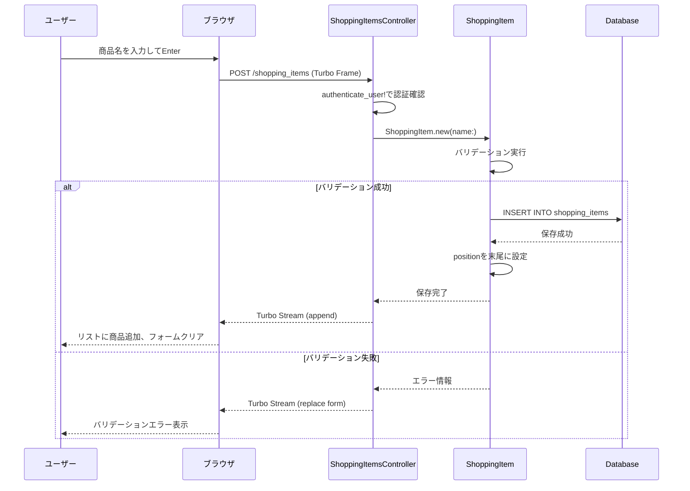
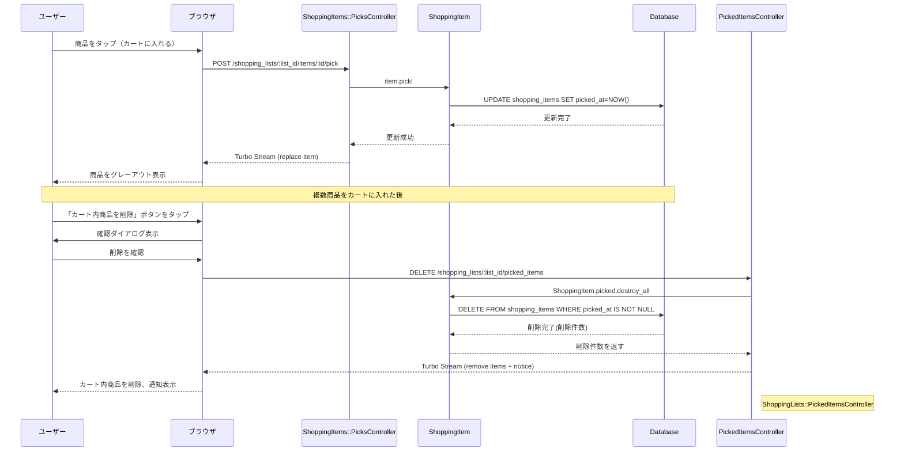
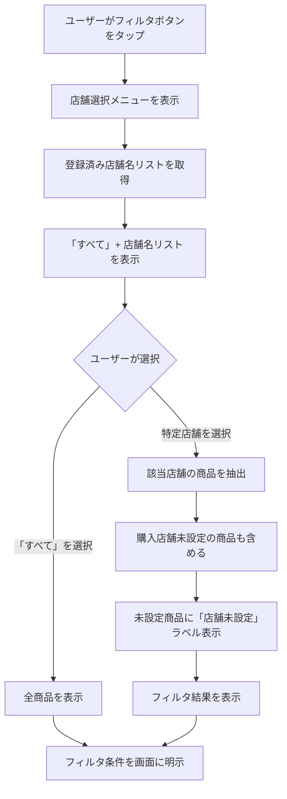

# 技術設計書 - 買い物リスト機能

## 概要

買い物リスト機能は、家族メンバーが共有できる買い物リスト管理システムです。この機能は、スマートフォンでの利用を最適化し、商品の追加から購入完了までのフローをシームレスにサポートします。

**目的:** 家族で買い物情報を共有し、買い忘れや重複購入を防ぐことで、効率的な買い物体験を提供します。

**対象ユーザー:** 認証済みの家族メンバー全員が同一のリストを共有し、誰でも商品の追加・編集・削除が可能です。

**影響:** 既存のユーザー認証システムを活用し、新たに買い物リスト管理ドメインを追加します。既存のDevise認証フローやUserモデルとの統合により、認証済みユーザーのみがアクセス可能な機能として実装されます。

### ゴール

- 商品名のみの入力で即座に商品を追加できる高速な入力体験
- 商品の並び替え、カート追加、フィルタリングによる柔軟なリスト管理
- 購入店舗による効率的な買い物計画のサポート
- スマートフォンに最適化されたタッチ操作とレスポンシブUI

### 非ゴール

- 個人専用リストの作成（将来拡張として考慮）
- カテゴリ別の自動分類機能（将来拡張として考慮）
- 商品の購入履歴や統計分析機能（将来拡張として考慮）
- リアルタイム同期機能（手動リフレッシュで対応）

## アーキテクチャ

### 既存アーキテクチャ分析

現在のシステムは、Rails 8のモノリシックアーキテクチャを採用しており、以下のパターンに従っています:

- **MVCアーキテクチャ**: 標準的なRails Way
- **Hotwireスタック**: Turbo + Stimulus による SPA風の体験
- **Devise認証**: User::DatabaseAuthentication モデルによる認証管理
- **ドメイン境界**: User ドメインが確立済み

**保持する既存パターン:**
- Devise認証フローとの統合（`authenticate_user!` ヘルパー）
- ApplicationController のヘルパーメソッド活用
- Turbo Frames/Streams による画面遷移なしの操作
- Tailwind CSS による一貫したデザインシステム

**新規ドメインの追加:**
- ShoppingList ドメインを新規追加
- User ドメインとの関連付け（家族共有リストの実現）

### 高レベルアーキテクチャ



**アーキテクチャ統合:**
- **既存パターンの保持**: Rails MVCアーキテクチャ、Hotwire、Devise認証フロー
- **新規コンポーネントの理由**: 買い物リストドメインを独立したモデル・コントローラーとして実装し、Userドメインとの疎結合を維持
- **技術スタックとの整合**: Rails 8、Turbo、Stimulus、Tailwind CSSの既存技術を活用
- **ステアリング準拠**: structure.md および tech.md で定義されたMVCパターン、Hotwire、TDD原則に準拠

### 技術スタック整合

買い物リスト機能は、既存の技術スタックに完全に準拠します:

**バックエンド:**
- Ruby 3.4.7 + Rails 8.0.3（既存）
- Active Record（既存ORM）
- SQLite3（既存データベース）

**フロントエンド:**
- Hotwire（Turbo + Stimulus）（既存）
- Tailwind CSS v4.x（既存デザインシステム）
- Importmap（既存JS管理）

**認証:**
- Devise 4.9（既存認証フレームワーク）
- ApplicationControllerのヘルパーメソッド活用

**新規導入の依存関係:**
- **positioning** gem: 並び順管理のためのRuby gem（2024年最新）
  - acts_as_listとranked-modelの長所を組み合わせた最新gem
  - シーケンシャルな整数値（1, 2, 3...）でデバッグが容易
  - Advisory Lockでリスト操作の整合性を保証
  - 効率的なデータベース更新
- **SortableJS**: ドラッグ&ドロップ並び替えのためのJavaScriptライブラリ
  - Importmap + CDN経由で読み込み
  - ビルドプロセス不要でシンプルな構成
  - 必要に応じて後からVendored版に移行可能

### 主要な設計決定

#### 決定1: 家族共有リストの実装方法

**決定:** 現時点では、全ユーザーが単一の共有リストを使用する最もシンプルな実装を採用します。

**コンテキスト:** 要件では「家族で共有する一つのリスト」が必要であり、将来的には個人リストへの拡張も考慮する必要があります。

**検討した代替案:**
1. **単一グローバルリスト**: すべてのユーザーが同じリストを共有（最もシンプル）
2. **家族グループモデル**: Familyモデルを作成し、ユーザーをグループ化
3. **所有者ベースリスト**: リストごとに所有者を設定し、共有設定を管理

**選択したアプローチ:** 単一グローバルリスト（代替案1）

現在のシステムには家族やグループの概念がないため、まずは単一の共有リストとして実装します。データモデルには将来の拡張に備えて `owner_id` カラムを用意しますが、現時点ではnullとして扱います。

**根拠:**
- MVP（Minimum Viable Product）として最速で価値を提供できる
- 既存のDevise認証フローをそのまま活用可能
- 将来的に家族グループ機能を追加する際も、データ移行が容易

**トレードオフ:**
- **獲得**: 実装の単純さ、早期リリース、学習コストの削減
- **犠牲**: 複数家族への対応、個人リストの作成は後続フェーズで実装

#### 決定2: 商品の並び替え実装

**決定:** `positioning` gem を使用した並び順管理を採用し、相対位置指定（`after`）による並び替えを実装します。

**コンテキスト:** ユーザーがドラッグ&ドロップで商品の順序を自由に変更できる必要があります。

**検討した代替案:**
1. **positioning gem + 相対位置指定**: 2024年最新のgem、`{ after: id }` 形式で位置指定
2. **positioning gem + 絶対位置指定**: 整数値で直接position指定（gemでは"last resort"扱い）
3. **acts_as_list gem**: 実績のある定番gem（シーケンシャルな整数値を使用）
4. **ranked-model gem**: パフォーマンス重視gem（大きな整数値を使用）
5. **独自実装**: positionカラムを自分で管理

**選択したアプローチ:** positioning gem + 相対位置指定（代替案1）

`positioning` gemを使用し、`{ after: id }` 形式の相対位置指定で並び替えを実装します。このgemはacts_as_listとranked-modelの両方のメンテナーが2024年にリリースした最新のベストプラクティスです。

**根拠:**
- **最新のベストプラクティス**: 2024年リリースの最新gem
- **gemの推奨する使い方**: READMEで相対位置指定が推奨されている
- **シーケンシャルな値**: 1, 2, 3... の値でデバッグが容易
- **整合性保証**: row-level lockで並行操作の整合性を保証
- **効率的なDB更新**: gemが最適な更新処理を自動実行
- **シンプルなAPI**: フロントエンドから前の要素IDを送るだけ
- **DOM APIとの親和性**: `previousElementSibling`との自然な対応
- **認知負荷の低さ**: 「前の要素の後に配置」という直感的な論理
- **買い物リストに最適**: 数十〜数百件の規模に最適化

**相対位置指定の実装詳細:**
- フロントエンド: ドラッグ終了時に`previousElementSibling`から前の要素IDを取得
- バックエンド: `item.update!(position: { after: previous_id })` で更新
- 先頭への移動: `{ after: null }` で自動的にリスト先頭に配置
- 末尾への移動: 最後の要素IDを`after`に指定

**トレードオフ:**
- **獲得**: 最新技術、gemの推奨パターン、整合性保証、シンプルな実装、将来の拡張性
- **犠牲**: 新しいgemのため、acts_as_listほど広く使われていない（ただし同じメンテナーによる実績あり）

#### 決定3: 購入店舗の入力補完実装

**決定:** 既存の `shopping_items` テーブルから店舗名を抽出し、使用頻度順にランキングする軽量な実装を採用します。

**コンテキスト:** ユーザーが過去に入力した店舗名を素早く再入力できるよう、オートコンプリート機能が必要です。

**検討した代替案:**
1. **shopping_itemsから抽出**: 既存データから動的に候補を生成
2. **storesテーブル**: 店舗マスタを別途管理
3. **外部API連携**: Google Places APIなどで店舗情報を取得

**選択したアプローチ:** shopping_itemsから抽出（代替案1）

`ShoppingItem.where.not(store_name: nil).group(:store_name).count` で使用頻度を集計し、上位10件を候補として返します。

**根拠:**
- 追加のデータモデルが不要で実装がシンプル
- ユーザーが実際に使った店舗のみが候補に表示される
- データの整合性管理が容易

**トレードオフ:**
- **獲得**: シンプルな実装、データの一貫性、メンテナンスコストの削減
- **犠牲**: 店舗情報の詳細管理（住所、営業時間など）は将来の拡張として残す

## システムフロー

### 商品追加フロー



### 商品ピックと一括削除フロー



### 店舗フィルタリングフロー



## 要件トレーサビリティ

| 要件 | 要件概要 | コンポーネント | インターフェース | フロー |
|------|---------|--------------|----------------|--------|
| 1.1 | 家族共有リストへのアクセス | ShoppingListsController, ShoppingList | index | - |
| 2.1-2.7 | 商品の追加 | ShoppingItemsController, ShoppingItem | create | 商品追加フロー |
| 3.1-3.6 | 商品情報の編集 | ShoppingItemsController, ShoppingItem | edit, update | - |
| 4.1-4.4 | 商品の並び替え | ShoppingItems::PositionsController, ShoppingItem | update | - |
| 5.1-5.3 | 商品の削除 | ShoppingItemsController, ShoppingItem | destroy | - |
| 6.1-6.4 | 商品をカートに入れる機能 | ShoppingItems::PicksController, ShoppingItem | create, destroy | 商品ピックと一括削除フロー |
| 7.1-7.5 | カート内商品の一括削除 | ShoppingLists::PickedItemsController, ShoppingItem | destroy | 商品ピックと一括削除フロー |
| 8.1-8.6 | 購入店舗によるフィルタリング | ShoppingListsController | index (with filter param) | 店舗フィルタリングフロー |
| 9.1-9.5 | 購入店舗の入力補完 | StoresController | index | - |
| 10.1-10.5 | リスト表示の基本情報 | ShoppingListsController, Views | index | - |
| 11.1-11.5 | レスポンシブ対応とタッチ操作 | Views, Stimulus Controllers | - | - |
| 12.1-12.4 | データの永続化とエラーハンドリング | 全コントローラー | rescue_from | - |
| 13.1-13.4 | セキュリティとアクセス制御 | ApplicationController | authenticate_user! | - |
| 14.1-14.3 | 将来の拡張性 | ShoppingList (owner_id) | - | - |

## ルーティング設計

### RESTfulリソース構造

買い物リスト機能は、RESTfulな原則に従い、リソース指向のルーティング設計を採用します。すべてのコントローラーアクションは標準的な7つのRESTアクション（index, show, new, edit, create, update, destroy）のみを使用します。

**設計原則:**
- **完全なネスティング**: すべてのリソースをshopping_lists配下にネスト
- **リソース指向**: 並び順やピック状態を独立したリソースとして表現
- **名前空間の活用**: 親リソース名で名前空間を切り、将来的な拡張性を確保

```ruby
# config/routes.rb
Rails.application.routes.draw do
  # 買い物リスト機能
  resources :shopping_lists, only: [:index] do
    # 買い物商品（短縮URL: items）
    resources :items, only: [:create, :edit, :update, :destroy], controller: 'shopping_items' do
      # 商品の並び順リソース（singular resource）
      resource :position, only: [:update], controller: 'shopping_items/positions'

      # 商品のピック状態リソース（singular resource）
      resource :pick, only: [:create, :destroy], controller: 'shopping_items/picks'
    end

    # ピック済み商品の一括削除リソース（singular resource）
    resource :picked_items, only: [:destroy], controller: 'shopping_lists/picked_items'
  end

  # 店舗名オートコンプリート（トップレベル）
  resources :stores, only: [:index]
end
```

**生成されるルート:**

| Prefix | Verb | URI Pattern | Controller#Action |
|--------|------|-------------|-------------------|
| shopping_lists | GET | /shopping_lists | shopping_lists#index |
| shopping_list_items | POST | /shopping_lists/:shopping_list_id/items | shopping_items#create |
| edit_shopping_list_item | GET | /shopping_lists/:shopping_list_id/items/:id/edit | shopping_items#edit |
| shopping_list_item | PATCH | /shopping_lists/:shopping_list_id/items/:id | shopping_items#update |
| shopping_list_item | DELETE | /shopping_lists/:shopping_list_id/items/:id | shopping_items#destroy |
| shopping_list_item_position | PATCH | /shopping_lists/:shopping_list_id/items/:item_id/position | shopping_items/positions#update |
| shopping_list_item_pick | POST | /shopping_lists/:shopping_list_id/items/:item_id/pick | shopping_items/picks#create |
| shopping_list_item_pick | DELETE | /shopping_lists/:shopping_list_id/items/:item_id/pick | shopping_items/picks#destroy |
| shopping_list_picked_items | DELETE | /shopping_lists/:shopping_list_id/picked_items | shopping_lists/picked_items#destroy |
| stores | GET | /stores | stores#index |

**設計上の利点:**
1. **Fat Controllerの回避**: 各コントローラーが単一責任を持ち、標準的なRESTアクションのみを使用
2. **再利用性**: 名前空間により、将来的に他のモデルでも同じパターンを適用可能
3. **一貫性**: すべてのリソースがshopping_lists配下にネストされ、階層が明確
4. **拡張性**: 新しいリソースを追加する際も同じパターンで統一可能

## コンポーネントとインターフェース

### ドメイン層

#### ShoppingListモデル

**責任と境界:**
- **主要な責任**: 買い物リスト自体を表現し、リストに含まれる商品を管理する
- **ドメイン境界**: ShoppingListドメイン（買い物リスト集約のルート）
- **データ所有権**: リストの基本情報（名前、所有者）を所有
- **トランザクション境界**: リスト自体の作成・更新・削除はShoppingListで完結

**依存関係:**
- **Inbound**: ShoppingListsController
- **Outbound**: User（将来の拡張に備えた関連）, ShoppingItem（has_many関連）
- **External**: なし

**契約定義:**

**モデル関連:**
```ruby
# ShoppingListモデル
class ShoppingList < ApplicationRecord
  has_many :items, class_name: 'ShoppingItem', dependent: :destroy
  belongs_to :owner, class_name: 'User', optional: true

  validates :name, presence: true
end
```

**スコープとクエリメソッド:**
```ruby
# デフォルトリストの取得（現時点では1つのみ）
scope :default, -> { first_or_create!(name: '買い物リスト') }

# 商品の総数を取得
def total_items_count
  items.count
end

# ピック済み商品数を取得（カートに入っている商品数）
def picked_items_count
  items.picked.count
end

# 未ピック商品数を取得（まだカートに入っていない商品数）
def unpicked_items_count
  items.unpicked.count
end
```

**事前条件:**
- リスト作成時: name が必須
- リスト削除時: 関連する商品も自動削除（dependent: :destroy）

**事後条件:**
- リスト作成後: データベースに永続化され、id が割り当てられる
- リスト削除後: 関連する shopping_items レコードもすべて削除される

**不変条件:**
- name は常に空でない文字列
- owner_id は null または有効なUserのid

#### ShoppingItemモデル

**責任と境界:**
- **主要な責任**: 個別の買い物商品を表現し、商品の属性（名前、数量、メモ、店舗、ピック状態、並び順）を管理する
- **ドメイン境界**: ShoppingItemドメイン（ShoppingList集約の一部）
- **データ所有権**: 商品の詳細情報（name, quantity, memo, store_name, picked_at, position）を所有
- **トランザクション境界**: 商品の作成・更新・削除はShoppingItemで完結

**依存関係:**
- **Inbound**: ShoppingItemsController, ShoppingItems::PositionsController, ShoppingItems::PicksController
- **Outbound**: ShoppingList（belongs_to関連）
- **External**: positioning gem

**契約定義:**

**モデル関連:**
```ruby
# ShoppingItemモデル
class ShoppingItem < ApplicationRecord
  belongs_to :shopping_list

  # positioning gemによる並び順管理
  # scopeを :shopping_list に設定することで、リストごとに独立した並び順を管理
  positioned on: :shopping_list

  validates :name, presence: true

  # ヘルパーメソッド
  def picked?
    picked_at.present?
  end

  def pick!
    update!(picked_at: Time.current)
  end

  def unpick!
    update!(picked_at: nil)
  end
end
```

**スコープとクエリメソッド:**
```ruby
# ピック済み商品を取得（カートに入っている商品）
scope :picked, -> { where.not(picked_at: nil) }

# 未ピック商品を取得（まだカートに入っていない商品）
scope :unpicked, -> { where(picked_at: nil) }

# 特定店舗の商品を取得（店舗未設定も含む）
scope :for_store, ->(store_name) {
  where(store_name: [store_name, nil])
}

# 使用頻度順の店舗名リストを取得（クラスメソッド）
def self.store_suggestions(query = nil, limit: 10)
  items = where.not(store_name: nil)
  items = items.where('store_name LIKE ?', "%#{query}%") if query.present?
  items.group(:store_name)
       .order('COUNT(*) DESC')
       .limit(limit)
       .pluck(:store_name)
end
```

**状態管理:**
- **状態モデル**: unpicked → picked（picked_at が nil → timestamp）
- **永続化**: すべての状態変更はデータベースに即座に保存
- **並行制御**: 楽観的ロック（Rails標準のタイムスタンプチェック）
- **履歴**: picked_at によりカートに入れた日時を記録（店舗での行動履歴）

**事前条件:**
- 商品作成時: name が必須、shopping_list_id が必須
- 並び替え時: 移動先の position が有効な範囲内

**事後条件:**
- 商品作成後: position が自動設定され、リストの末尾に配置される
- 商品ピック後: picked_at にタイムスタンプが記録され、視覚的に区別される
- 並び替え後: 他の商品の position が自動再計算される

**不変条件:**
- name は常に空でない文字列
- position は常に0以上の整数
- picked_at は nil または有効な DATETIME 値

### アプリケーション層

#### ShoppingListsController

**責任と境界:**
- **主要な責任**: 買い物リストの表示とフィルタリングを制御する
- **ドメイン境界**: プレゼンテーション層とドメイン層の橋渡し
- **データ所有権**: なし（ビューに渡すデータの準備のみ）
- **トランザクション境界**: なし（読み取り専用の操作）

**依存関係:**
- **Inbound**: Routes, Views
- **Outbound**: ShoppingList, ShoppingItem
- **External**: Devise（authenticate_user!）

**契約定義:**

**RESTful API契約:**

| Method | Endpoint | Request | Response | Errors |
|--------|----------|---------|----------|--------|
| GET | /shopping_lists | Query: `store_name` (optional) | HTML (Turbo Frame) | 401 (未認証), 500 |

**アクション詳細:**

```ruby
class ShoppingListsController < ApplicationController
  before_action :authenticate_user!

  # GET /shopping_lists
  # パラメータ:
  #   - store_name (optional): フィルタする店舗名
  # レスポンス:
  #   - @shopping_list: デフォルトの買い物リスト
  #   - @items: フィルタ適用後の商品リスト
  #   - @stores: 店舗名の候補リスト
  def index
    @shopping_list = ShoppingList.default
    @items = filter_items(@shopping_list.items, params[:store_name])
    @stores = ShoppingItem.distinct.pluck(:store_name).compact.sort
  end

  private

  def filter_items(items, store_name)
    return items if store_name.blank? || store_name == 'all'
    items.for_store(store_name)
  end
end
```

**事前条件:**
- ユーザーが認証済みであること（authenticate_user!）

**事後条件:**
- @shopping_list に有効なShoppingListオブジェクトが設定される
- @items にフィルタ適用後の商品リストが設定される

#### ShoppingItemsController

**責任と境界:**
- **主要な責任**: 商品の基本的なCRUD操作（作成、編集、更新、削除）を制御する
- **ドメイン境界**: プレゼンテーション層とドメイン層の橋渡し
- **データ所有権**: なし（モデルへの操作を委譲）
- **トランザクション境界**: 各アクションごとにトランザクションが暗黙的に開始・終了（Active Recordの標準動作）

**依存関係:**
- **Inbound**: Routes, Views
- **Outbound**: ShoppingList, ShoppingItem
- **External**: Devise（authenticate_user!）

**契約定義:**

**RESTful API契約:**

| Method | Endpoint | Request | Response | Errors |
|--------|----------|---------|----------|--------|
| POST | /shopping_lists/:shopping_list_id/items | JSON: `{ name: string, quantity?: string, memo?: text, store_name?: string }` | Turbo Stream (append) | 400 (validation), 401, 500 |
| GET | /shopping_lists/:shopping_list_id/items/:id/edit | - | Turbo Frame (form) | 401, 404, 500 |
| PATCH | /shopping_lists/:shopping_list_id/items/:id | JSON: `{ name: string, quantity?: string, memo?: text, store_name?: string }` | Turbo Stream (replace) | 400, 401, 404, 500 |
| DELETE | /shopping_lists/:shopping_list_id/items/:id | - | Turbo Stream (remove) | 401, 404, 500 |

**アクション詳細:**

```ruby
# app/controllers/shopping_items_controller.rb
class ShoppingItemsController < ApplicationController
  before_action :authenticate_user!
  before_action :set_shopping_list
  before_action :set_shopping_item, only: [:edit, :update, :destroy]

  # POST /shopping_lists/:shopping_list_id/items
  # Turbo Frameリクエストで商品を追加
  def create
    @item = @shopping_list.items.build(item_params)
    # positioning gemが自動的に末尾に配置

    if @item.save
      # Turbo Streamでリストに追加し、フォームをクリア
      respond_to do |format|
        format.turbo_stream
      end
    else
      # バリデーションエラーをフォームに表示
      respond_to do |format|
        format.turbo_stream { render turbo_stream: turbo_stream.replace('item_form', partial: 'form', locals: { item: @item }) }
      end
    end
  end

  # GET /shopping_lists/:shopping_list_id/items/:id/edit
  # Turbo Frameリクエストで編集フォームを表示
  def edit
    respond_to do |format|
      format.turbo_stream
    end
  end

  # PATCH /shopping_lists/:shopping_list_id/items/:id
  # 商品情報を更新
  def update
    if @item.update(item_params)
      respond_to do |format|
        format.turbo_stream
      end
    else
      respond_to do |format|
        format.turbo_stream { render turbo_stream: turbo_stream.replace("edit_item_#{@item.id}", partial: 'form', locals: { item: @item }) }
      end
    end
  end

  # DELETE /shopping_lists/:shopping_list_id/items/:id
  # 商品を削除
  def destroy
    @item.destroy
    respond_to do |format|
      format.turbo_stream
    end
  end

  private

  def set_shopping_list
    @shopping_list = ShoppingList.default
  end

  def set_shopping_item
    @item = @shopping_list.items.find(params[:id])
  end

  def item_params
    params.require(:shopping_item).permit(:name, :quantity, :memo, :store_name)
  end
end
```

**事前条件:**
- ユーザーが認証済みであること
- 操作対象の商品がデフォルトリストに存在すること

**事後条件:**
- 作成/更新/削除操作後、Turbo Streamで画面が自動更新される
- バリデーションエラー時、エラーメッセージがフォームに表示される

#### ShoppingItems::PositionsController

**責任と境界:**
- **主要な責任**: 商品の並び順リソースを管理し、ドラッグ&ドロップによる並び替えを処理する
- **ドメイン境界**: プレゼンテーション層とドメイン層の橋渡し
- **データ所有権**: なし（ShoppingItemモデルのposition属性を更新）
- **トランザクション境界**: positioning gemが内部でAdvisory Lockを使用して整合性を保証

**依存関係:**
- **Inbound**: Routes, Stimulus Controllers (SortableController)
- **Outbound**: ShoppingList, ShoppingItem
- **External**: Devise（authenticate_user!）, positioning gem

**契約定義:**

**RESTful API契約:**

| Method | Endpoint | Request | Response | Errors |
|--------|----------|---------|----------|--------|
| PATCH | /shopping_lists/:shopping_list_id/items/:item_id/position | JSON: `{ position: { after: integer \| null } }` | JSON: `{ success: boolean }` | 400, 401, 404, 500 |

**アクション詳細:**

```ruby
# app/controllers/shopping_items/positions_controller.rb
module ShoppingItems
  class PositionsController < ApplicationController
    before_action :authenticate_user!
    before_action :set_shopping_list
    before_action :set_shopping_item

    # PATCH /shopping_lists/:shopping_list_id/items/:item_id/position
    # ドラッグ&ドロップで並び順を更新
    #
    # パラメータ:
    #   position: { after: id } - 指定したid の商品の後に配置
    #   position: { after: null } - リストの先頭に配置
    def update
      # positioning gemに直接渡す
      # { after: id } または { after: null } の形式
      # positioning gemが自動的に他の商品のpositionを再計算
      # row-level lockにより並行操作の整合性を保証
      @item.update!(position: params[:position])

      render json: { success: true }
    rescue => e
      Rails.logger.error("Position update failed: #{e.message}")
      render json: { success: false, error: '並び替えに失敗しました' }, status: :unprocessable_entity
    end

    private

    def set_shopping_list
      @shopping_list = ShoppingList.default
    end

    def set_shopping_item
      @item = @shopping_list.items.find(params[:item_id])
    end
  end
end
```

**事前条件:**
- ユーザーが認証済みであること
- 操作対象の商品が存在すること
- position パラメータが `{ after: id }` または `{ after: null }` の形式であること

**事後条件:**
- 商品が指定された位置に移動される
- 他の商品のpositionが自動的に再計算される（positioning gem）

#### ShoppingItems::PicksController

**責任と境界:**
- **主要な責任**: 商品のピック状態リソースを管理し、カートへの出し入れを処理する
- **ドメイン境界**: プレゼンテーション層とドメイン層の橋渡し
- **データ所有権**: なし（ShoppingItemモデルのpicked_at属性を更新）
- **トランザクション境界**: 各アクションごとにトランザクションが暗黙的に開始・終了

**依存関係:**
- **Inbound**: Routes, Views
- **Outbound**: ShoppingList, ShoppingItem
- **External**: Devise（authenticate_user!）

**契約定義:**

**RESTful API契約:**

| Method | Endpoint | Request | Response | Errors |
|--------|----------|---------|----------|--------|
| POST | /shopping_lists/:shopping_list_id/items/:item_id/pick | - | Turbo Stream (replace) | 401, 404, 500 |
| DELETE | /shopping_lists/:shopping_list_id/items/:item_id/pick | - | Turbo Stream (replace) | 401, 404, 500 |

**アクション詳細:**

```ruby
# app/controllers/shopping_items/picks_controller.rb
module ShoppingItems
  class PicksController < ApplicationController
    before_action :authenticate_user!
    before_action :set_shopping_list
    before_action :set_shopping_item

    # POST /shopping_lists/:shopping_list_id/items/:item_id/pick
    # 商品を買い物カートに入れる（ピックする）
    def create
      @item.pick!

      respond_to do |format|
        format.turbo_stream
      end
    end

    # DELETE /shopping_lists/:shopping_list_id/items/:item_id/pick
    # 商品を買い物カートから出す（ピックを解除する）
    def destroy
      @item.unpick!

      respond_to do |format|
        format.turbo_stream
      end
    end

    private

    def set_shopping_list
      @shopping_list = ShoppingList.default
    end

    def set_shopping_item
      @item = @shopping_list.items.find(params[:item_id])
    end
  end
end
```

**事前条件:**
- ユーザーが認証済みであること
- 操作対象の商品が存在すること

**事後条件:**
- create: picked_atに現在時刻が記録される（商品が買い物カートに入った時刻）
- destroy: picked_atがnilに設定される（商品が買い物カートから出された）
- Turbo Streamで商品の表示が更新される

#### ShoppingLists::PickedItemsController

**責任と境界:**
- **主要な責任**: ピック済み商品（買い物カートに入っている商品）の一括削除リソースを管理する
- **ドメイン境界**: プレゼンテーション層とドメイン層の橋渡し
- **データ所有権**: なし（複数のShoppingItemを一括削除）
- **トランザクション境界**: Active Recordの暗黙的トランザクション内で一括削除

**依存関係:**
- **Inbound**: Routes, Views
- **Outbound**: ShoppingList, ShoppingItem
- **External**: Devise（authenticate_user!）

**契約定義:**

**RESTful API契約:**

| Method | Endpoint | Request | Response | Errors |
|--------|----------|---------|----------|--------|
| DELETE | /shopping_lists/:shopping_list_id/picked_items | - | Turbo Stream (remove + notice) | 401, 500 |

**アクション詳細:**

```ruby
# app/controllers/shopping_lists/picked_items_controller.rb
module ShoppingLists
  class PickedItemsController < ApplicationController
    before_action :authenticate_user!
    before_action :set_shopping_list

    # DELETE /shopping_lists/:shopping_list_id/picked_items
    # ピック済み商品を一括削除（購入完了後の整理）
    def destroy
      deleted_count = @shopping_list.items.picked.destroy_all.size

      respond_to do |format|
        format.turbo_stream do
          render turbo_stream: [
            turbo_stream.remove_all('.shopping-item.picked'),
            turbo_stream.prepend('flash', partial: 'shared/notice', locals: { message: "#{deleted_count}件の商品を削除しました" })
          ]
        end
      end
    end

    private

    def set_shopping_list
      @shopping_list = ShoppingList.default
    end
  end
end
```

**事前条件:**
- ユーザーが認証済みであること
- リストに1つ以上のピック済み商品が存在すること（UIで制御）

**事後条件:**
- すべてのピック済み商品（picked_at が nil でない商品）が削除される
- 削除件数が通知メッセージで表示される

#### StoresController

**責任と境界:**
- **主要な責任**: 店舗名の入力補完候補を提供する
- **ドメイン境界**: プレゼンテーション層とドメイン層の橋渡し
- **データ所有権**: なし（ShoppingItemから店舗名を抽出）
- **トランザクション境界**: 読み取り専用の操作

**依存関係:**
- **Inbound**: Routes, Stimulus Controllers (AutocompleteController)
- **Outbound**: ShoppingItem
- **External**: Devise（authenticate_user!）

**契約定義:**

**RESTful API契約:**

| Method | Endpoint | Request | Response | Errors |
|--------|----------|---------|----------|--------|
| GET | /stores | Query: `q` (string, optional) | JSON: `{ stores: string[] }` | 401, 500 |

**アクション詳細:**

```ruby
# app/controllers/stores_controller.rb
class StoresController < ApplicationController
  before_action :authenticate_user!

  # GET /stores
  # 店舗名の入力補完候補を返す
  def index
    stores = ShoppingItem.store_suggestions(params[:q], limit: 10)
    render json: { stores: stores }
  end
end
```

**事前条件:**
- ユーザーが認証済みであること

**事後条件:**
- 最大10件の店舗名候補がJSON形式で返される
- 候補は使用頻度の高い順にソートされる

### プレゼンテーション層

#### Stimulusコントローラー

##### SortableController

**責任と境界:**
- **主要な責任**: ドラッグ&ドロップによる商品の並び替えUIを提供し、サーバーに並び順を送信する
- **ドメイン境界**: フロントエンドのDOM操作とサーバーAPIの橋渡し

**依存関係:**
- **Inbound**: Views (data-controller="sortable")
- **Outbound**: ShoppingItemsController#reorder (AJAX)
- **External**: SortableJS ライブラリ

**契約定義:**

```javascript
// app/javascript/controllers/sortable_controller.js
import { Controller } from "@hotwired/stimulus"
import Sortable from "sortablejs"

export default class extends Controller {
  static values = {
    url: String  // 並び替えAPIのURL（個別商品のposition更新エンドポイント）
  }

  connect() {
    // SortableJSを初期化
    this.sortable = Sortable.create(this.element, {
      animation: 150,
      onEnd: this.onEnd.bind(this)
    })
  }

  disconnect() {
    if (this.sortable) {
      this.sortable.destroy()
    }
  }

  async onEnd(event) {
    // 移動先の直前のアイテムIDを取得
    const previousElement = event.item.previousElementSibling
    const afterId = previousElement?.dataset.itemId || null

    try {
      const response = await fetch(this.urlValue, {
        method: 'PATCH',
        headers: {
          'Content-Type': 'application/json',
          'X-CSRF-Token': document.querySelector('[name="csrf-token"]').content
        },
        body: JSON.stringify({
          position: { after: afterId }
        })
      })

      if (!response.ok) {
        throw new Error('Failed to reorder')
      }
    } catch (error) {
      console.error('Reorder error:', error)
      // エラー時は元の位置に戻す
      this.sortable.option("disabled", true)
      setTimeout(() => {
        this.sortable.option("disabled", false)
      }, 100)
    }
  }
}
```

**外部依存関係の調査:**

SortableJSは、ドラッグ&ドロップ機能を提供する軽量ライブラリです。

- **公式サイト**: https://github.com/SortableJS/Sortable
- **バージョン**: 1.15.x (最新安定版)
- **配信方法**: CDN経由（jsDelivr）
- **主要API**:
  - `Sortable.create(element, options)`: Sortableインスタンスを作成
  - `onEnd`: ドラッグ終了時のコールバック
  - `animation`: アニメーション時間（ミリ秒）
- **ブラウザ対応**: モダンブラウザ全般（iOS Safari, Chrome, Firefox）
- **ライセンス**: MIT License

**Importmap設定:**
```ruby
# config/importmap.rb
pin "sortablejs", to: "https://cdn.jsdelivr.net/npm/sortablejs@1.15.0/Sortable.min.js"
```

**利点:**
- ビルドプロセス不要
- 設定がシンプル
- 後から`bin/importmap pin sortablejs --download`でVendored版に移行可能

**考慮事項:**
- CDN（jsDelivr）への外部依存
- オフライン開発環境では動作しない（必要に応じてVendored版に移行）

##### AutocompleteController

**責任と境界:**
- **主要な責任**: 購入店舗入力時のオートコンプリート候補を表示する
- **ドメイン境界**: フロントエンドのUI制御とサーバーAPIの橋渡し

**依存関係:**
- **Inbound**: Views (data-controller="autocomplete")
- **Outbound**: ShoppingItemsController#autocomplete_stores (AJAX)
- **External**: なし（Stimulus標準機能のみ）

**契約定義:**

```javascript
// app/javascript/controllers/autocomplete_controller.js
import { Controller } from "@hotwired/stimulus"

export default class extends Controller {
  static targets = ["input", "results"]
  static values = {
    url: String  // オートコンプリートAPIのURL
  }

  connect() {
    this.timeout = null
  }

  async search() {
    clearTimeout(this.timeout)

    const query = this.inputTarget.value.trim()

    if (query.length === 0) {
      this.hideResults()
      return
    }

    // デバウンス処理（300ms）
    this.timeout = setTimeout(async () => {
      try {
        const response = await fetch(`${this.urlValue}?q=${encodeURIComponent(query)}`)
        const data = await response.json()
        this.displayResults(data.stores)
      } catch (error) {
        console.error('Autocomplete error:', error)
      }
    }, 300)
  }

  displayResults(stores) {
    if (stores.length === 0) {
      this.hideResults()
      return
    }

    this.resultsTarget.innerHTML = stores.map(store =>
      `<div class="autocomplete-item" data-action="click->autocomplete#select" data-value="${store}">
        ${store}
      </div>`
    ).join('')
    this.resultsTarget.classList.remove('hidden')
  }

  select(event) {
    this.inputTarget.value = event.currentTarget.dataset.value
    this.hideResults()
  }

  hideResults() {
    this.resultsTarget.classList.add('hidden')
    this.resultsTarget.innerHTML = ''
  }
}
```

## データモデル

### 物理データモデル

買い物リスト機能のデータモデルは、SQLite3データベース上に以下のテーブルで構成されます。

#### shopping_listsテーブル

買い物リスト自体を表すテーブル。現時点では全ユーザーが1つのリストを共有します。

| カラム名 | 型 | 制約 | 説明 |
|---------|---|-----|-----|
| id | INTEGER | PRIMARY KEY | リストID |
| name | VARCHAR(255) | NOT NULL | リスト名（デフォルト: "買い物リスト"） |
| owner_id | INTEGER | NULL, FOREIGN KEY(users.id) | 将来の拡張用: リストの所有者 |
| created_at | DATETIME | NOT NULL | 作成日時 |
| updated_at | DATETIME | NOT NULL | 更新日時 |

**インデックス:**
- `index_shopping_lists_on_owner_id`: owner_idへのインデックス（将来の拡張に備えて）

**マイグレーション例:**
```ruby
class CreateShoppingLists < ActiveRecord::Migration[8.0]
  def change
    create_table :shopping_lists do |t|
      t.string :name, null: false
      t.references :owner, foreign_key: { to_table: :users }, null: true

      t.timestamps
    end
  end
end
```

#### shopping_itemsテーブル

個別の買い物商品を表すテーブル。

| カラム名 | 型 | 制約 | 説明 |
|---------|---|-----|-----|
| id | INTEGER | PRIMARY KEY | 商品ID |
| shopping_list_id | INTEGER | NOT NULL, FOREIGN KEY(shopping_lists.id) | 所属する買い物リストID |
| name | VARCHAR(255) | NOT NULL | 商品名 |
| quantity | VARCHAR(100) | NULL | 数量（任意、例: "2個", "500g"） |
| memo | TEXT | NULL | メモ（任意） |
| store_name | VARCHAR(255) | NULL | 購入店舗（任意） |
| picked_at | DATETIME | NULL | ピック日時（カートに入れた時刻、カートに入っていない場合はnull） |
| position | INTEGER | NOT NULL | 並び順（positioning gemが自動管理） |
| created_at | DATETIME | NOT NULL | 作成日時 |
| updated_at | DATETIME | NOT NULL | 更新日時 |

**インデックス:**
- `index_shopping_items_on_shopping_list_id_and_position`: リストIDとpositionの複合ユニークインデックス（positioning gem推奨）
- `index_shopping_items_on_store_name`: 店舗名でのフィルタリングを高速化
- `index_shopping_items_on_picked_at`: ピック状態での検索を高速化

**マイグレーション例:**
```ruby
class CreateShoppingItems < ActiveRecord::Migration[8.0]
  def change
    create_table :shopping_items do |t|
      t.references :shopping_list, null: false, foreign_key: true
      t.string :name, null: false
      t.string :quantity
      t.text :memo
      t.string :store_name
      t.datetime :picked_at  # ピック日時（nilの場合は未ピック）
      t.integer :position, null: false  # positioning gemが自動管理

      t.timestamps
    end

    add_index :shopping_items, [:shopping_list_id, :position], unique: true
    add_index :shopping_items, :store_name
    add_index :shopping_items, :picked_at
  end
end
```

### データ整合性とトランザクション

**参照整合性:**
- shopping_items.shopping_list_id → shopping_lists.id: 外部キー制約により保証
- shopping_lists.owner_id → users.id: 外部キー制約により保証（NULL許可）
- リスト削除時: `dependent: :destroy` により関連商品も自動削除

**トランザクション境界:**
- **商品の並び替え**: positioning gemがAdvisory Lockを使用してposition値の一貫性を自動保証
- **ピック済み商品の一括削除**: 単一のDELETEクエリで実行（Active Recordのトランザクション内）

**データの一貫性:**
- position値: positioning gemが自動的に管理し、重複や欠番を防ぐ
- picked_at状態: DATETIME型またはnull、ピック日時の履歴を保持
- 並行操作: positioning gemのAdvisory Lockにより、複数ユーザーの同時並び替えでも整合性を維持

## エラーハンドリング

### エラー戦略

買い物リスト機能では、ユーザーに明確なフィードバックを提供し、データの整合性を保つために、以下のエラーカテゴリごとに適切な処理を行います。

### エラーカテゴリと対応

#### ユーザーエラー（4xx）

**バリデーションエラー（400）:**
- **発生条件**: 商品名が空、不正なパラメータ
- **対応**: フォーム内にエラーメッセージを表示し、入力項目をハイライト
- **実装**: Turbo Streamでフォームを置き換え、エラーメッセージを表示

```ruby
# コントローラー内でのハンドリング
if @item.save
  # 成功時の処理
else
  respond_to do |format|
    format.turbo_stream do
      render turbo_stream: turbo_stream.replace(
        'item_form',
        partial: 'form',
        locals: { item: @item }
      ), status: :unprocessable_entity
    end
  end
end
```

**未認証エラー（401）:**
- **発生条件**: ログインせずに買い物リストにアクセス
- **対応**: ログイン画面にリダイレクト
- **実装**: Devise の `authenticate_user!` が自動的に処理

**リソース未検出（404）:**
- **発生条件**: 存在しない商品IDを指定
- **対応**: 404エラーページまたはリスト画面にリダイレクト
- **実装**: Active Recordの `find` メソッドが `ActiveRecord::RecordNotFound` を発生

```ruby
# ApplicationController でのグローバルハンドリング
rescue_from ActiveRecord::RecordNotFound do |exception|
  redirect_to shopping_lists_path, alert: '商品が見つかりませんでした'
end
```

#### システムエラー（5xx）

**データベースエラー（500）:**
- **発生条件**: データベース接続失敗、ディスク容量不足
- **対応**: 汎用エラーページを表示し、再試行を促す
- **実装**: Rails標準のエラーハンドリング + ロギング

```ruby
# ApplicationController でのグローバルハンドリング
rescue_from StandardError do |exception|
  Rails.logger.error("Unexpected error: #{exception.message}")
  Rails.logger.error(exception.backtrace.join("\n"))

  respond_to do |format|
    format.html { render 'errors/500', status: :internal_server_error }
    format.json { render json: { error: '予期しないエラーが発生しました' }, status: :internal_server_error }
  end
end
```

**トランザクションエラー:**
- **発生条件**: 並び替え中のトランザクション失敗
- **対応**: ロールバックし、エラーメッセージを表示
- **実装**: ActiveRecord::Base.transaction内でrescue

```ruby
def reorder
  ActiveRecord::Base.transaction do
    # 並び替え処理
  end
  render json: { success: true }
rescue => e
  Rails.logger.error("Reorder failed: #{e.message}")
  render json: { success: false, error: '並び替えに失敗しました' }, status: :unprocessable_entity
end
```

#### ビジネスロジックエラー（422）

**状態遷移エラー:**
- **発生条件**: 既にチェック済みの商品を再度チェック（現在は発生しないが、将来の拡張に備えて）
- **対応**: エラーメッセージを表示し、操作を無視
- **実装**: モデルのバリデーションまたはコントローラーでの事前チェック

### 監視とロギング

**エラー追跡:**
- Rails.logger を使用してすべてのエラーをログに記録
- production環境では、エラー監視サービス（Sentry、Rollbarなど）との統合を推奨（将来の拡張）

**ヘルスモニタリング:**
- `/up` エンドポイントでアプリケーションの稼働状態を確認
- データベース接続の正常性チェック

**ログレベル:**
- development: DEBUG（すべてのクエリとエラー）
- production: INFO（エラーと重要なイベントのみ）

## テスト戦略

### ユニットテスト

**ShoppingListモデル:**
- バリデーション: name の presence
- 関連: items の has_many
- スコープ: default の動作確認
- メソッド: total_items_count, picked_items_count, unpicked_items_count

**ShoppingItemモデル:**
- バリデーション: name の presence、position の数値型
- 関連: shopping_list の belongs_to
- スコープ: picked, unpicked, for_store
- クラスメソッド: store_suggestions
- ヘルパーメソッド: picked?, pick!, unpick!

### 統合テスト

**商品追加フロー:**
- 認証済みユーザーが商品を追加できる
- 商品名が空の場合、バリデーションエラーが表示される
- 追加後、フォームがクリアされる

**商品編集フロー:**
- 商品をタップして編集フォームを開ける
- 購入店舗フィールドで入力補完候補が表示される
- 変更を保存すると、リスト表示が更新される

**商品ピックと一括削除フロー:**
- 商品をタップすると、商品がグレーアウトする（picked_atにタイムスタンプが記録され、買い物カートに入った状態になる）
- カート内商品が存在する場合、一括削除ボタンが表示される
- 一括削除を実行すると、カート内商品がすべて削除される

**店舗フィルタリングフロー:**
- フィルタボタンをタップすると、店舗選択メニューが表示される
- 特定店舗を選択すると、該当商品と未設定商品が表示される
- 「すべて」を選択すると、全商品が表示される

### E2E/UIテスト（System Spec）

**商品追加から購入完了までのフロー:**
1. ログイン
2. 買い物リストページを開く
3. 商品名を入力してEnter
4. 商品がリストに追加されることを確認
5. 商品をタップして編集フォームを開く
6. 購入店舗を入力して保存
7. 店舗フィルタで該当店舗を選択
8. 商品をタップして買い物カートに入れる
9. カート内商品の一括削除ボタンをタップして削除

**ドラッグ&ドロップによる並び替え:**
1. 複数の商品を追加
2. 商品をドラッグして位置を変更
3. 並び順が保存されることを確認

**エラーハンドリング:**
1. 商品名を空で追加しようとする
2. バリデーションエラーが表示されることを確認
3. 未認証状態でアクセス
4. ログイン画面にリダイレクトされることを確認

### パフォーマンステスト

**大量商品の表示:**
- 100件の商品を登録し、ページ読み込み時間を計測（目標: 1秒以内）
- 店舗フィルタ適用時の応答時間を計測（目標: 500ms以内）

**並び替え操作:**
- 50件の商品の並び順を変更し、positionの再計算時間を計測（目標: 200ms以内）

**入力補完のレスポンス:**
- 30件の店舗名履歴から候補を抽出する時間を計測（目標: 100ms以内）

## セキュリティ考慮事項

### 認証と認可

**認証:**
- すべてのコントローラーで `before_action :authenticate_user!` を設定
- Devise の標準認証フローを活用

**認可:**
- 現時点では、すべての認証済みユーザーが同じリストにアクセス可能
- 将来の拡張で家族グループ機能を追加する際は、グループメンバーシップの確認を追加

### データ保護

**Strong Parameters:**
- `item_params` メソッドで許可された属性のみを受け付ける
- mass assignment脆弱性を防止

**XSS対策:**
- ERBの自動エスケープにより、ユーザー入力がそのまま表示されることを防ぐ
- 商品名、メモ、店舗名などのユーザー入力は常にエスケープ

**CSRF対策:**
- Rails標準のCSRFトークン検証を有効化
- Turbo Frameリクエストでも自動的にトークンを送信

**SQLインジェクション対策:**
- Active Recordのパラメータ化クエリを使用
- 生のSQLは使用しない

### アクセス制御

**リソースへのアクセス:**
- 未認証ユーザーは買い物リストにアクセス不可
- 将来の拡張: 家族グループ外のユーザーは他の家族のリストにアクセス不可

**APIエンドポイントの保護:**
- すべてのAPIエンドポイントで認証を必須化
- 不正なリクエストは401エラーを返す

## 将来の拡張性

### 個人リストと家族グループ

現在の設計では、shopping_listsテーブルに `owner_id` カラムを用意しており、将来的に以下の拡張が可能です:

1. **家族グループモデルの追加**: Familyモデルを作成し、ユーザーをグループ化
2. **リスト所有者の設定**: `owner_id` に実際のユーザーIDを設定
3. **共有設定の追加**: リストごとに共有範囲を設定（家族全体、個人のみ）
4. **アクセス制御の強化**: グループメンバーシップの確認を追加

### カテゴリ機能

商品にカテゴリを追加する場合、以下の拡張が可能です:

1. **categoriesテーブルの追加**: カテゴリマスタを作成
2. **shopping_items.category_id の追加**: 商品とカテゴリの関連付け
3. **カテゴリ別フィルタリング**: 店舗フィルタと同様の仕組みで実装
4. **カテゴリ別の並び替え**: カテゴリごとにグループ化して表示

### 購入履歴と統計

商品の購入履歴を記録する場合、以下の拡張が可能です:

1. **purchase_historiesテーブルの追加**: 購入日時、店舗、商品名を記録
2. **よく買う商品の分析**: 購入頻度に基づいたレコメンデーション
3. **購入傾向の可視化**: 月別・店舗別の購入統計をグラフ表示
