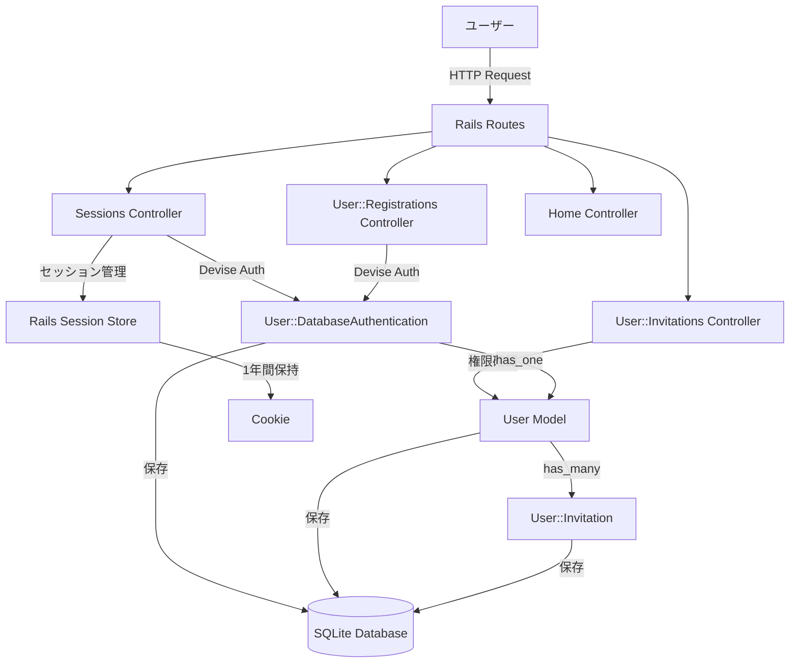
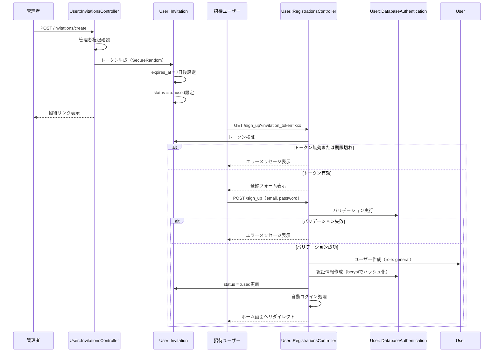
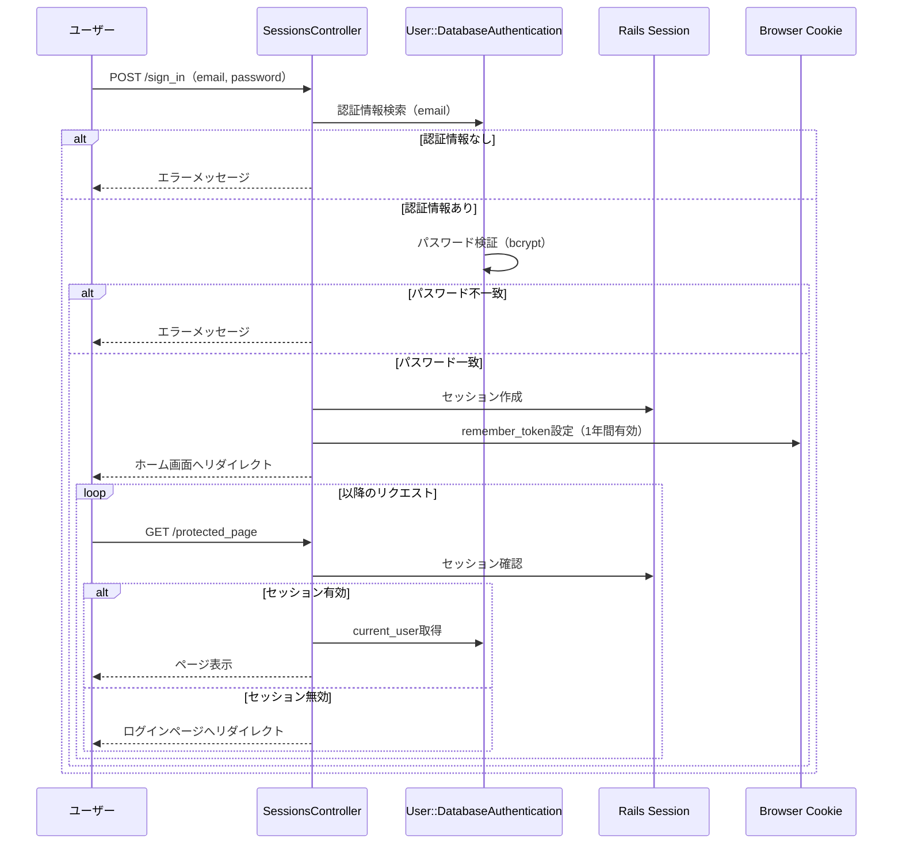
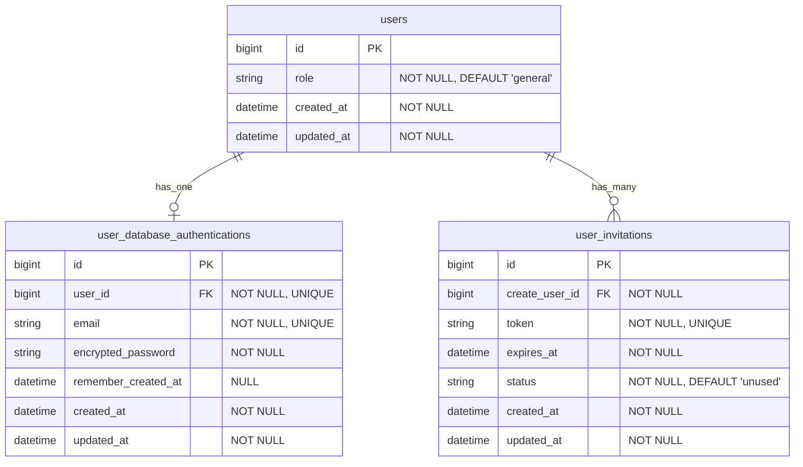
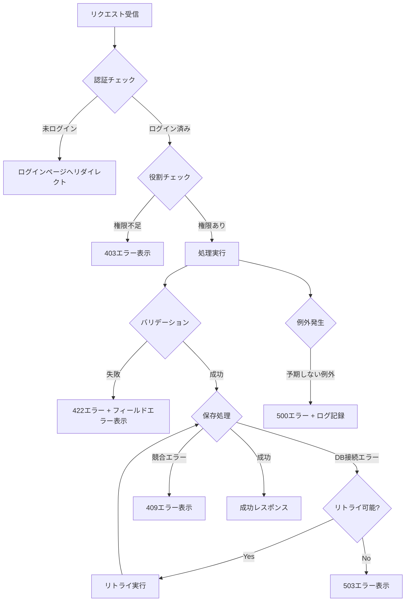
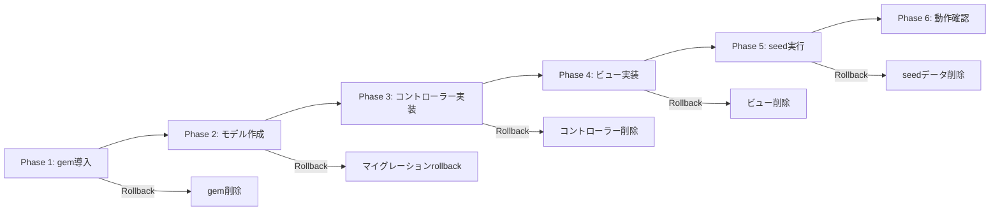

# 技術設計ドキュメント

## 概要

本機能は、Family Appに招待ベースのユーザー認証システムを実装します。管理者が招待リンクを生成し、招待されたユーザーのみがアカウントを作成できる仕組みを提供します。DeviseとRails標準機能を組み合わせ、セキュアで使いやすい認証体験を実現します。

**目的**: 家族向けアプリケーションとして、信頼できるユーザーのみがアクセスできる安全な空間を構築し、管理者による柔軟なメンバー管理を可能にします。

**利用者**: Family Appを利用する家族メンバー（管理者と一般ユーザー）が、招待リンクを通じてアカウント登録、ログイン、ログアウトを行います。

**影響**: 既存システムに新しい認証レイヤーを追加し、全てのコントローラーとビューがログイン状態を意識する必要があります。

### ゴール
- Deviseを用いた堅牢な認証基盤の構築
- 招待ベースの登録フローによる安全なユーザー管理
- 1年間の長期セッション維持による利便性の向上
- 管理者と一般ユーザーの役割ベースアクセス制御
- seedデータによる初期管理者の自動セットアップ

### 非ゴール
- 多要素認証（MFA）の実装（将来的な拡張として検討）
- ソーシャルログイン（OAuth）の統合
- パスワードリセット機能（初期実装では除外、将来追加可能）
- メール送信機能（招待リンクはコピー&ペーストで共有）
- 複数の役割タイプ（現時点では管理者と一般ユーザーのみ）

## アーキテクチャ

### 高レベルアーキテクチャ



### アーキテクチャ統合

**既存パターンの維持**:
- Rails MVCアーキテクチャに従った標準的な構成
- Concernsパターンによる共通ロジックの再利用
- Hotwireによるモダンなフロントエンド体験

**新規コンポーネントの追加理由**:
- `User`モデル: 基本情報と役割管理を担当（最小限の責務）
- `User::DatabaseAuthentication`モデル: Devise統合による認証情報管理
- `User::Invitation`モデル: 招待機能の独立した管理
- カスタムコントローラー: Deviseのデフォルト動作をカスタマイズ

**技術スタック適合**:
- Ruby 3.4.7 + Rails 8.0.3
- SQLite 3 for database
- Devise gem for authentication core
- Hotwire (Turbo + Stimulus) for UI
- Tailwind CSS for styling

**ステアリング遵守**:
- Rails Way: Convention over Configuration
- TDD: RSpecによるテスト駆動開発
- セキュリティファースト: bcrypt、CSRF、Strong Parameters
- DRY: モデルの責務分離とConcernsの活用

### 技術スタック整合性

本機能は既存のFamily Appの技術スタックに完全に適合します:

**新規依存関係**:
- `devise` gem (~> 4.9): Rails認証の業界標準、Deviseモジュールを`User::DatabaseAuthentication`モデルに適用
- `bcrypt` gem (~> 3.1.7): Deviseが内部で使用するパスワードハッシュ化

**既存技術の活用**:
- Rails 8.0.3のセッション管理機構
- SQLiteデータベース（既存の構成を継続）
- Hotwire (Turbo)によるフォーム送信
- Tailwind CSSによるスタイリング

**ステアリング遵守の確認**:
- MVCアーキテクチャパターンの維持
- Concernsパターンによる認証ロジックの共有（`Authentication` concern）
- RESTfulなルーティング設計

### 主要な設計決定

#### 決定1: Userモデルと認証情報の分離

**決定**: Userモデルは基本情報（id, role）のみを保持し、認証情報（email, password）は`User::DatabaseAuthentication`モデルで管理する

**コンテキスト**: Deviseは通常、単一のUserモデルに全ての情報を格納する設計ですが、今回は責務の明確な分離と将来の拡張性を重視します

**代替案**:
1. 単一Userモデルにすべてを統合（Deviseの標準パターン）
2. Profile情報も含めた3層構造（User、Authentication、Profile）
3. STI（Single Table Inheritance）による役割の実装

**選択したアプローチ**: User + User::DatabaseAuthenticationの2層構造
- Userモデル: `id`, `role`（enum: admin/general）
- User::DatabaseAuthentication: `email`, `encrypted_password`, `user_id`（Devise適用）
- 関連: `User has_one :database_authentication`, `User::DatabaseAuthentication belongs_to :user`

**理由**:
- 認証ロジックとビジネスロジックの明確な分離
- Deviseの強力な機能を`DatabaseAuthentication`モデルで活用
- 将来的なProfile情報の追加が容易
- テストの独立性が向上（認証のテストとビジネスロジックのテストを分離）

**トレードオフ**:
- **獲得**: 責務の明確化、テスト容易性、拡張性
- **犠牲**: わずかなクエリオーバーヘッド（JOIN必要）、Deviseのデフォルト実装からの逸脱

#### 決定2: カスタム招待システムの実装

**決定**: `devise_invitable` gemを使用せず、独自の`User::Invitation`モデルとコントローラーで招待機能を実装する

**コンテキスト**: 招待機能には特定の要件（7日間の有効期限、1回のみ使用可能、トークンベースのリンク共有）があり、シンプルで制御しやすい実装が必要

**代替案**:
1. `devise_invitable` gemの使用（Deviseの公式拡張）
2. Action Mailerと組み合わせたメール招待システム
3. 招待コード方式（トークンではなく短いコードを共有）

**選択したアプローチ**: カスタムInvitationモデルとコントローラー
- `User::Invitation`モデル: `token`, `create_user_id`, `expires_at`, `status`（enum: unused/used）
- `User::InvitationsController`: 招待の作成、一覧表示
- `User::RegistrationsController`: 招待トークンの検証とアカウント作成

**理由**:
- 要件に完全に適合したシンプルな実装
- `devise_invitable`の不要な機能（メール送信、複雑な招待管理）を避ける
- コードの可読性と保守性の向上
- テストの容易性（外部gemの動作に依存しない）

**トレードオフ**:
- **獲得**: シンプルさ、完全な制御、要件への完全適合
- **犠牲**: 既存gemの成熟した機能を使えない、独自実装のメンテナンス

#### 決定3: 1年間の長期セッション実装

**決定**: Deviseの`rememberable`モジュールを使用し、`remember_for`を1年間に設定することで長期セッションを実現する

**コンテキスト**: 家族向けアプリケーションとして、頻繁なログインを要求せず利便性を優先する必要がある

**代替案**:
1. デフォルトの2週間セッション
2. JWTトークンベースの認証
3. OAuth2的なリフレッシュトークン方式

**選択したアプローチ**: Deviseの`rememberable`モジュールで1年間設定
```ruby
# User::DatabaseAuthenticationモデル
devise :database_authenticatable, :rememberable, remember_for: 1.year

# Deviseイニシャライザ
config.remember_for = 1.year
config.extend_remember_period = true
```

**理由**:
- Deviseの標準機能で簡単に実現可能
- セキュアなトークン管理が既に実装されている
- Rails標準のCookie暗号化と組み合わせて安全性を確保
- 実装がシンプルで保守しやすい

**トレードオフ**:
- **獲得**: 利便性の大幅な向上、シンプルな実装、Devise標準機能の活用
- **犠牲**: セキュリティリスクのわずかな増加（長期間有効なCookie）、デバイスの盗難時のリスク

## システムフロー

### 招待ベース登録フロー



### ログイン・セッション管理フロー



## 要件トレーサビリティ

| 要件 | 要件概要 | コンポーネント | インターフェース | フロー |
|------|----------|----------------|------------------|--------|
| 1.1-1.10 | 招待ベース登録 | User::Invitation, User::RegistrationsController | POST /sign_up, Invitation#validate | 招待ベース登録フロー |
| 2.1-2.5 | ログイン機能 | SessionsController, User::DatabaseAuthentication | POST /sign_in, Devise認証 | ログイン・セッション管理フロー |
| 3.1-3.3 | ログアウト機能 | SessionsController | DELETE /sign_out | ログイン・セッション管理フロー |
| 4.1-4.7 | セッション管理・長期ログイン | Rails Session, Devise rememberable | Deviseセッション管理 | ログイン・セッション管理フロー |
| 5.1-5.5 | アクセス制御 | ApplicationController (Authentication concern) | before_action :authenticate_user! | 全コントローラー |
| 6.1-6.4 | ユーザー識別 | ApplicationController | current_user, user_signed_in? | 全コントローラー・ビュー |
| 7.1-7.6 | セキュリティ | Devise, Rails CSRF, Strong Parameters | bcrypt, CSRF tokens | 全フロー |
| 8.1-8.5 | UI | Views, Hotwire, Tailwind CSS | ERBテンプレート、Turbo | 全ビュー |
| 9.1-9.6 | 役割管理 | User (role enum) | User#admin?, User#general? | 全コンポーネント |
| 10.1-10.9 | 招待機能 | User::InvitationsController, User::Invitation | POST /invitations, GET /invitations | 招待ベース登録フロー |
| 11.1-11.5 | 初期管理者 | db/seeds.rb, User, User::DatabaseAuthentication | Rails seedコマンド | seedスクリプト |

## コンポーネントとインターフェース

### 認証ドメイン

#### User (ユーザー基本情報)

**責務と境界**
- **主要責務**: ユーザーの基本情報と役割を管理する
- **ドメイン境界**: 認証ドメインの中心エンティティ、ビジネスロジックの起点
- **データ所有**: ユーザーID、役割情報
- **トランザクション境界**: 認証情報、招待情報と連携するがトランザクションは分離

**依存関係**
- **インバウンド**: ApplicationController (current_user)、全コントローラー
- **アウトバウンド**: User::DatabaseAuthentication (認証情報)、User::Invitation (招待情報)
- **外部**: なし

**契約定義**

```typescript
// Userモデルインターフェース
interface User {
  id: number;
  role: 'admin' | 'general';
  created_at: DateTime;
  updated_at: DateTime;

  // 関連
  database_authentication: User::DatabaseAuthentication;
  invitations: User::Invitation[];

  // メソッド
  admin?(): boolean;
  general?(): boolean;
}
```

**状態管理**
- **状態モデル**: 役割による状態（admin/general）
- **永続化**: SQLiteデータベース、usersテーブル
- **並行性**: 楽観的ロック（updated_atによるバージョン管理）

#### User::DatabaseAuthentication (認証情報)

**責務と境界**
- **主要責務**: メールアドレスとパスワードによる認証を管理する
- **ドメイン境界**: Devise統合ポイント、認証ロジックの実装
- **データ所有**: メールアドレス、暗号化パスワード、remember_token
- **トランザクション境界**: User作成時に同時作成、Userのトランザクション内

**依存関係**
- **インバウンド**: SessionsController、RegistrationsController
- **アウトバウンド**: User（親モデル）
- **外部**: Devise gem (database_authenticatable, rememberable モジュール)

**外部依存の調査**:
- Devise gem バージョン ~> 4.9
- 使用モジュール: `:database_authenticatable`, `:rememberable`
- 認証フロー: `valid_password?`メソッドでbcrypt比較
- セッション管理: `remember_me!`メソッドでトークン生成
- 設定: `remember_for: 1.year`で長期セッション
- APIドキュメント: https://rubydoc.info/github/heartcombo/devise

**契約定義**

```typescript
// User::DatabaseAuthenticationモデルインターフェース
interface DatabaseAuthentication {
  id: number;
  user_id: number;
  email: string; // unique, format validation
  encrypted_password: string; // bcrypt hash
  remember_created_at: DateTime | null;
  created_at: DateTime;
  updated_at: DateTime;

  // Deviseメソッド
  valid_password?(password: string): boolean;
  password=(new_password: string): void;
  remember_me!(): void;
  forget_me!(): void;
}
```

- **事前条件**: email形式が有効、passwordが8文字以上
- **事後条件**: パスワードはbcryptでハッシュ化され、平文は保存されない
- **不変条件**: emailはユニーク、user_idは必須

**API契約**

| メソッド | エンドポイント | リクエスト | レスポンス | エラー |
|----------|----------------|------------|------------|--------|
| POST | /users/sign_in | { user: { email, password } } | redirect to root | 401 (Unauthorized) |
| POST | /users/sign_up | { user: { email, password }, invitation_token } | redirect to root | 422 (Unprocessable) |
| DELETE | /users/sign_out | - | redirect to sign_in | - |

**状態管理**
- **状態モデル**: 認証済み/未認証
- **永続化**: SQLiteデータベース、user_database_authenticationsテーブル
- **並行性**: emailユニーク制約による重複防止

#### User::Invitation (招待情報)

**責務と境界**
- **主要責務**: 招待リンクの生成、検証、状態管理を行う
- **ドメイン境界**: 招待サブドメイン、登録フローの入り口
- **データ所有**: 招待トークン、有効期限、使用状態、作成者
- **トランザクション境界**: 独立したトランザクション、User作成時に状態更新

**依存関係**
- **インバウンド**: User::InvitationsController、User::RegistrationsController
- **アウトバウンド**: User（create_user）
- **外部**: SecureRandom (トークン生成)

**契約定義**

```typescript
// User::Invitationモデルインターフェース
interface Invitation {
  id: number;
  token: string; // unique, SecureRandom.urlsafe_base64(32)
  create_user_id: number; // Userのid (管理者)
  expires_at: DateTime; // 7日後
  status: 'unused' | 'used';
  created_at: DateTime;
  updated_at: DateTime;

  // 関連
  create_user: User;

  // メソッド
  valid?(): boolean; // 期限内かつunused
  mark_as_used!(): void;
  expired?(): boolean;
}
```

- **事前条件**: create_userは管理者権限を持つ
- **事後条件**: トークンはユニーク、有効期限は7日後に設定
- **不変条件**: 一度usedになったら変更不可

**API契約**

| メソッド | エンドポイント | リクエスト | レスポンス | エラー |
|----------|----------------|------------|------------|--------|
| POST | /invitations | - | { token, expires_at, url } | 403 (Forbidden if not admin) |
| GET | /invitations | - | [{ token, expires_at, status }] | 403 (Forbidden if not admin) |

**状態管理**
- **状態モデル**: unused → used (単方向遷移)
- **永続化**: SQLiteデータベース、user_invitationsテーブル
- **並行性**: tokenユニーク制約、楽観的ロック

### コントローラー層

#### SessionsController (Deviseカスタマイズ)

**責務と境界**
- **主要責務**: ログイン、ログアウト、セッション管理を処理する
- **ドメイン境界**: 認証フローのエントリーポイント
- **データ所有**: セッション情報（Railsセッションストア）
- **トランザクション境界**: セッション作成・破棄

**依存関係**
- **インバウンド**: ユーザーからのHTTPリクエスト
- **アウトバウンド**: User::DatabaseAuthentication (Devise)、Session Store
- **外部**: Devise::SessionsController (継承)

**契約定義**

```ruby
class SessionsController < Devise::SessionsController
  # POST /users/sign_in
  def create
    super do |resource|
      # カスタムロジック: ログイン成功時の処理
    end
  end

  # DELETE /users/sign_out
  def destroy
    super
  end

  private

  def after_sign_in_path_for(resource)
    stored_location_for(resource) || root_path
  end

  def after_sign_out_path_for(resource_or_scope)
    new_user_session_path
  end
end
```

#### User::RegistrationsController (Deviseカスタマイズ)

**責務と境界**
- **主要責務**: 招待トークンを検証し、新規ユーザー登録を処理する
- **ドメイン境界**: 招待ベース登録フローの実装
- **データ所有**: なし（User、User::DatabaseAuthentication、User::Invitationを操作）
- **トランザクション境界**: User + DatabaseAuthentication作成、Invitation更新

**依存関係**
- **インバウンド**: 招待リンクからのHTTPリクエスト
- **アウトバウンド**: User、User::DatabaseAuthentication、User::Invitation
- **外部**: Devise::RegistrationsController (継承)

**契約定義**

```ruby
class User::RegistrationsController < Devise::RegistrationsController
  before_action :validate_invitation_token, only: [:new, :create]

  # GET /users/sign_up?invitation_token=xxx
  def new
    @invitation = User::Invitation.find_by(token: params[:invitation_token])
    super
  end

  # POST /users/sign_up
  def create
    ActiveRecord::Base.transaction do
      @user = User.new(role: :general)
      @user.build_database_authentication(sign_up_params)

      if @user.save
        @invitation.mark_as_used!
        sign_in(@user.database_authentication)
        redirect_to root_path
      else
        render :new
      end
    end
  end

  private

  def validate_invitation_token
    @invitation = User::Invitation.find_by(token: params[:invitation_token])

    unless @invitation&.valid?
      flash[:error] = "招待リンクが無効または期限切れです"
      redirect_to root_path
    end
  end

  def sign_up_params
    params.require(:user).permit(:email, :password, :password_confirmation)
  end
end
```

#### User::InvitationsController

**責務と境界**
- **主要責務**: 招待リンクの生成と管理を行う
- **ドメイン境界**: 管理者専用の招待管理機能
- **データ所有**: なし（User::Invitationを操作）
- **トランザクション境界**: Invitation作成・更新

**依存関係**
- **インバウンド**: 管理者からのHTTPリクエスト
- **アウトバウンド**: User::Invitation、current_user
- **外部**: SecureRandom (トークン生成)

**契約定義**

```ruby
class User::InvitationsController < ApplicationController
  before_action :authenticate_user!
  before_action :require_admin!

  # GET /invitations
  def index
    @invitations = current_user.invitations.order(created_at: :desc)
  end

  # POST /invitations
  def create
    @invitation = current_user.invitations.build(
      token: SecureRandom.urlsafe_base64(32),
      expires_at: 7.days.from_now,
      status: :unused
    )

    if @invitation.save
      @invitation_url = sign_up_url(invitation_token: @invitation.token)
      flash[:success] = "招待リンクを生成しました"
    else
      flash[:error] = "招待リンクの生成に失敗しました"
    end

    redirect_to invitations_path
  end

  private

  def require_admin!
    unless current_user.admin?
      flash[:error] = "管理者権限が必要です"
      redirect_to root_path
    end
  end
end
```

#### ApplicationController (認証基盤)

**責務と境界**
- **主要責務**: 全コントローラーに認証機能を提供する
- **ドメイン境界**: アプリケーション全体の認証レイヤー
- **データ所有**: なし
- **トランザクション境界**: なし（リクエストごとの認証確認）

**契約定義**

```ruby
class ApplicationController < ActionController::Base
  before_action :authenticate_user!, unless: :devise_controller?

  # Deviseのcurrent_userをオーバーライドしてUserモデルを返す
  def current_user
    @current_user ||= current_database_authentication&.user
  end

  # Deviseが提供するUser::DatabaseAuthenticationインスタンスを取得
  def current_database_authentication
    @current_database_authentication ||= warden.authenticate(scope: :user)
  end

  # ヘルパーメソッドとして公開
  helper_method :current_user

  # user_signed_in?もオーバーライド
  def user_signed_in?
    current_user.present?
  end
  helper_method :user_signed_in?
end
```

## データモデル

### 物理データモデル



### テーブル定義

#### usersテーブル

| カラム名 | 型 | 制約 | 説明 |
|----------|-----|------|------|
| id | bigint | PRIMARY KEY | 自動採番ID |
| role | integer | NOT NULL, DEFAULT 1 | 役割（0: admin, 1: general）enumで管理 |
| created_at | datetime | NOT NULL | 作成日時 |
| updated_at | datetime | NOT NULL | 更新日時 |

**インデックス**:
- PRIMARY KEY (id)

#### user_database_authenticationsテーブル

| カラム名 | 型 | 制約 | 説明 |
|----------|-----|------|------|
| id | bigint | PRIMARY KEY | 自動採番ID |
| user_id | bigint | NOT NULL, UNIQUE | usersテーブルへの外部キー |
| email | string | NOT NULL, UNIQUE | メールアドレス |
| encrypted_password | string | NOT NULL | bcryptでハッシュ化されたパスワード |
| remember_created_at | datetime | NULL | remember_meトークン作成日時 |
| created_at | datetime | NOT NULL | 作成日時 |
| updated_at | datetime | NOT NULL | 更新日時 |

**インデックス**:
- PRIMARY KEY (id)
- UNIQUE INDEX (user_id)
- UNIQUE INDEX (email)

**外部キー**:
- user_id REFERENCES users(id) ON DELETE CASCADE

#### user_invitationsテーブル

| カラム名 | 型 | 制約 | 説明 |
|----------|-----|------|------|
| id | bigint | PRIMARY KEY | 自動採番ID |
| create_user_id | bigint | NOT NULL | usersテーブルへの外部キー（招待作成者） |
| token | string | NOT NULL, UNIQUE | 招待トークン（32文字のランダム文字列） |
| expires_at | datetime | NOT NULL | 有効期限（作成から7日後） |
| status | integer | NOT NULL, DEFAULT 0 | 状態（0: unused, 1: used）enumで管理 |
| created_at | datetime | NOT NULL | 作成日時 |
| updated_at | datetime | NOT NULL | 更新日時 |

**インデックス**:
- PRIMARY KEY (id)
- UNIQUE INDEX (token)
- INDEX (create_user_id)
- INDEX (status, expires_at) - 有効な招待の検索用

**外部キー**:
- create_user_id REFERENCES users(id) ON DELETE CASCADE

### データ整合性とバリデーション

**Userモデル**:
```ruby
class User < ApplicationRecord
  enum role: { admin: 0, general: 1 }

  has_one :database_authentication, class_name: 'User::DatabaseAuthentication', dependent: :destroy
  has_many :invitations, class_name: 'User::Invitation', foreign_key: :create_user_id, dependent: :destroy

  validates :role, presence: true

  def admin?
    role == 'admin'
  end

  def general?
    role == 'general'
  end
end
```

**User::DatabaseAuthenticationモデル**:
```ruby
class User::DatabaseAuthentication < ApplicationRecord
  devise :database_authenticatable, :rememberable, remember_for: 1.year

  belongs_to :user

  validates :email, presence: true, uniqueness: true, format: { with: URI::MailTo::EMAIL_REGEXP }
  validates :password, length: { minimum: 8 }, if: :password_required?

  private

  def password_required?
    !persisted? || !password.nil? || !password_confirmation.nil?
  end
end
```

**User::Invitationモデル**:
```ruby
class User::Invitation < ApplicationRecord
  enum status: { unused: 0, used: 1 }

  belongs_to :create_user, class_name: 'User'

  validates :token, presence: true, uniqueness: true
  validates :expires_at, presence: true
  validates :status, presence: true

  scope :valid_invitations, -> { where(status: :unused).where('expires_at > ?', Time.current) }

  def valid?
    unused? && expires_at > Time.current
  end

  def expired?
    expires_at <= Time.current
  end

  def mark_as_used!
    update!(status: :used)
  end
end
```

## エラーハンドリング

### エラー戦略

認証システムでは、セキュリティとユーザビリティのバランスを取りながら、適切なエラーハンドリングを実装します。

### エラーカテゴリと対応

**ユーザーエラー (4xx)**:
- **無効な入力** (422):
  - メールアドレス形式不正 → フィールドレベルのバリデーションメッセージ
  - パスワード8文字未満 → フィールドレベルのバリデーションメッセージ
  - メールアドレス重複 → 「このメールアドレスは既に使用されています」
- **認証失敗** (401):
  - ログイン失敗 → 「メールアドレスまたはパスワードが正しくありません」（意図的に曖昧）
  - セッション期限切れ → ログインページへ自動リダイレクト
- **権限不足** (403):
  - 管理者専用ページへのアクセス → 「管理者権限が必要です」+ ホームへリダイレクト
- **リソース未検出** (404):
  - 存在しない招待トークン → 「招待リンクが無効または期限切れです」

**システムエラー (5xx)**:
- **データベース接続エラー** (503):
  - 接続タイムアウト → エラーページ表示、管理者に通知
  - ロック競合 → リトライ処理（最大3回）
- **内部エラー** (500):
  - 予期しない例外 → 汎用エラーページ、ログに詳細記録

**ビジネスロジックエラー** (422):
- **招待リンク無効**:
  - 期限切れ → 「招待リンクの有効期限が切れています」
  - 既に使用済み → 「この招待リンクは既に使用されています」
- **アカウント状態競合**:
  - 同時登録 → 「このメールアドレスは既に使用されています」

### エラーフロー



### モニタリング

**エラートラッキング**:
- Rails標準のlogger使用
- エラーレベル分類: DEBUG, INFO, WARN, ERROR, FATAL
- 重要なイベントのログ記録:
  - ログイン成功・失敗
  - 招待リンク生成・使用
  - 権限エラー
  - データベースエラー

**ヘルスモニタリング**:
- `/health`エンドポイント: データベース接続確認
- セッションストアの健全性チェック
- Deviseの動作確認

## テスト戦略

### ユニットテスト

**Userモデル**:
- 役割のenumが正しく機能すること
- `admin?`、`general?`メソッドが正しく動作すること
- 関連（database_authentication、invitations）が正しく設定されていること

**User::DatabaseAuthenticationモデル**:
- メールアドレスのバリデーション（形式、ユニーク性）
- パスワードの最小長バリデーション（8文字以上）
- パスワードのbcrypt暗号化
- Deviseの`valid_password?`メソッド動作確認

**User::Invitationモデル**:
- トークンのユニーク性
- 有効期限の設定（7日後）
- `valid?`メソッド（unused + 期限内）
- `mark_as_used!`メソッドの状態遷移
- `expired?`メソッドの期限判定

### 統合テスト

**招待ベース登録フロー**:
- 管理者が招待リンクを生成できること
- 招待リンクからアクセスして登録フォームが表示されること
- 有効な招待トークンで登録が成功すること
- 無効な招待トークンで登録が失敗すること
- 期限切れの招待トークンで登録が失敗すること

**ログイン/ログアウトフロー**:
- 正しい認証情報でログインできること
- 誤った認証情報でログインが失敗すること
- ログアウト後に認証が必要なページにアクセスできないこと
- remember_meトークンで1年間ログイン状態が維持されること

**アクセス制御**:
- 未ログインユーザーが保護されたページにアクセスできないこと
- 一般ユーザーが管理者専用ページにアクセスできないこと
- ログイン後に元のページにリダイレクトされること

### E2Eテスト

**ユーザー登録からログインまでの完全フロー**:
- 管理者が招待リンクを生成
- 招待リンクから新規ユーザーが登録
- 登録後に自動ログインしてホーム画面に遷移
- ログアウト
- 再ログイン成功

**招待リンク管理フロー**:
- 管理者が招待リンク一覧を表示
- 招待リンクの状態（未使用/使用済み）を確認
- 期限切れの招待リンクが無効として表示されること

### パフォーマンステスト

**ログイン処理**:
- 100並行ログインリクエストを処理できること
- レスポンスタイム: 平均200ms以下

**招待トークン検証**:
- トークン検証クエリが最適化されていること（インデックス使用）
- 1000件の招待データでも検証が高速（50ms以下）

## セキュリティ考慮事項

### 脅威モデリング

**認証バイパス攻撃**:
- 対策: Deviseの堅牢な認証機構、bcryptによるパスワードハッシュ化
- 対策: タイミング攻撃対策（Devise内蔵の安全な比較）

**セッションハイジャック**:
- 対策: HTTPS通信の強制（本番環境）
- 対策: セキュアCookie設定（`secure: true`, `httponly: true`）
- 対策: CSRF保護（Rails標準機能）

**招待トークン推測攻撃**:
- 対策: 32文字のランダムトークン（SecureRandom.urlsafe_base64）
- 対策: 7日間の有効期限
- 対策: 1回のみ使用可能

**SQLインジェクション**:
- 対策: ActiveRecordのパラメータ化クエリ
- 対策: Strong Parametersによる入力制限

**XSS攻撃**:
- 対策: ERBの自動エスケープ
- 対策: Content Security Policy設定

### 認証と認可

**認証パターン**:
- Deviseのdatabase_authenticatable + rememberableモジュール
- セッションベース認証（Cookie + Server-side session）
- 1年間の長期remember_meトークン

**認可パターン**:
- 役割ベースアクセス制御（RBAC: admin/general）
- コントローラーレベルのbefore_actionで権限チェック
- `require_admin!`メソッドによる管理者専用アクセス制御

### データ保護

**パスワード保護**:
- bcryptアルゴリズム（cost: 12）
- 平文パスワードは一切保存しない
- パスワード検証は安全な比較メソッド使用

**個人情報保護**:
- メールアドレスはユニークかつインデックス化
- ログにパスワードや招待トークンを記録しない
- filter_parameter_loggingでpasswordをマスク

**セッション保護**:
- セッションIDの定期的なローテーション
- ログアウト時のセッション完全破棄
- remember_meトークンの安全な保存

## パフォーマンスとスケーラビリティ

### ターゲットメトリクス

**レスポンスタイム**:
- ログイン処理: 平均200ms、95パーセンタイル500ms以下
- 招待トークン検証: 平均50ms以下
- 認証チェック（current_user取得): 平均10ms以下

**スループット**:
- 同時ログインユーザー: 100ユーザー以上
- 招待リンク生成: 秒間10リクエスト以上

### スケーリングアプローチ

**データベース最適化**:
- 適切なインデックス設定（email、token、status）
- N+1クエリ防止（`includes`使用）
- コネクションプーリング（Railsデフォルト: 5）

**セッション管理**:
- Railsデフォルトのcookie_storeを使用（軽量）
- 必要に応じてRedisベースのセッションストアに移行可能

**キャッシング戦略**:
- current_userのメモ化（`@current_user_model`）
- 招待リンク一覧のページネーション（将来的に必要な場合）

### 最適化技術

**クエリ最適化**:
```ruby
# N+1を避けるため、includes使用
@invitations = current_user.invitations.includes(:create_user).order(created_at: :desc)
```

**インデックス戦略**:
- user_database_authentications(email): ログイン高速化
- user_invitations(token): 招待トークン検証高速化
- user_invitations(status, expires_at): 有効な招待検索高速化

## 移行戦略

### 移行フェーズ



### プロセス

**Phase 1: gem導入**:
- Gemfileに`devise`追加
- `bundle install`実行
- Deviseインストーラー実行: `rails generate devise:install`

**Phase 2: モデル作成**:
- Userモデル生成
- User::DatabaseAuthenticationモデル生成（Devise適用）
- User::Invitationモデル生成
- マイグレーション実行

**Phase 3: コントローラー実装**:
- SessionsController（Deviseカスタマイズ）
- User::RegistrationsController（Deviseカスタマイズ）
- User::InvitationsController
- ApplicationControllerに認証設定追加

**Phase 4: ビュー実装**:
- ログインフォーム
- 登録フォーム（招待トークン検証付き）
- 招待リンク生成画面
- 招待リンク一覧画面

**Phase 5: seed実行**:
- 初期管理者アカウント作成
- `rails db:seed`実行

**Phase 6: 動作確認**:
- ログイン/ログアウトテスト
- 招待リンク生成テスト
- 招待ベース登録テスト
- 権限制御テスト

### ロールバックトリガー

**Phase 1-2のロールバック条件**:
- gem依存関係の競合
- マイグレーション失敗
- モデルバリデーションエラー

**Phase 3-4のロールバック条件**:
- Deviseカスタマイズの不具合
- ルーティング競合
- ビューレンダリングエラー

**Phase 5-6のロールバック条件**:
- 初期管理者作成失敗
- 認証フロー全体の不具合
- パフォーマンス問題

### バリデーションチェックポイント

**Phase 2完了後**:
- マイグレーションが成功していること
- モデルのバリデーションが正しく動作すること
- 関連が正しく設定されていること

**Phase 4完了後**:
- 全てのビューが正しくレンダリングされること
- フォーム送信が正しく動作すること
- Turboが正しく機能すること

**Phase 6完了後**:
- 全てのRSpecテストがパスすること
- 招待ベース登録フローが完全に動作すること
- セキュリティ要件が満たされていること
